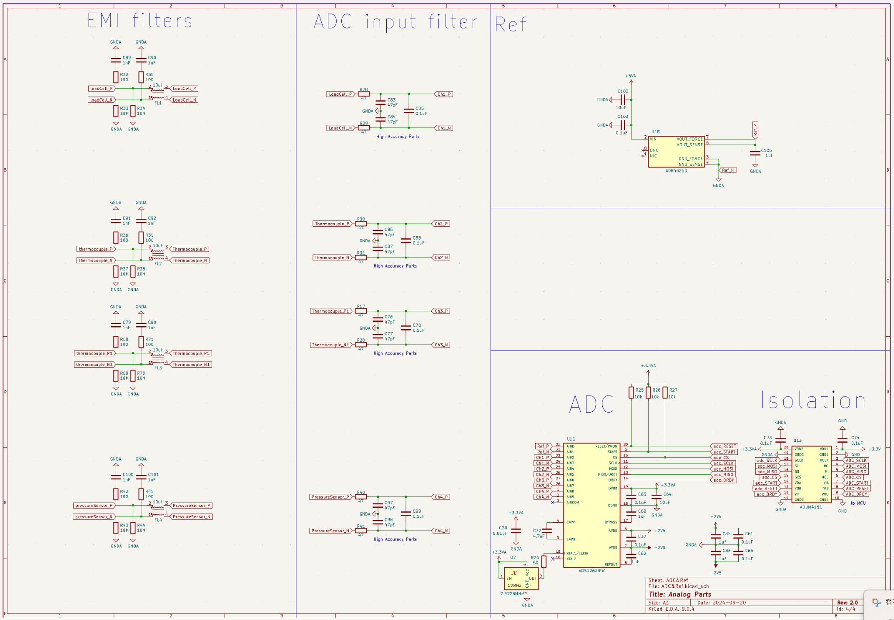

# ANCP Rocket Motor Test Station (Rev 2.0)

> 고정추진제 로켓 모터(ANCP) 지상시험을 위한 **정밀 계측·점화 제어 스테이션**  
> 고정밀 아날로그 체인(로드셀/압력/열전대), **안전 중심 점화 시퀀스**, **2″ LCD(LVGL9 + SPI DMA)** GUI, PC 텔레메트리 지원


---

##  주요 기능

- **안전 중심 점화 플로우**
  - 물리 **IGN 스위치** 감지 → 카운트다운 → 온도/추력 인터록 → 핫와이어 제어
  - 모터/보드/PC 준비 상태 점검(미준비 시 시험 중지)
- **정밀 계측 체인**
  - 로드셀(추력), 챔버 압력, 노즐/내부 온도(열전대), IMU 진동
  - 메인/IGN 배터리 **셀 별 전압** + 메인 배터리 전류(INA219)
- **2″ LCD GUI (LVGL v9)**
  - **SPI DMA** 플러시(논블로킹), SquareLine Studio 기반 화면
  - Idle/Test/Config/Cal 페이지, FPS 확보 위해 라인 버퍼 + DMA 이중버퍼
- **EEPROM 기반 설정/보정**
  - **32B 페이지** 체크섬 저장 포맷(캘리브레이션 오프셋/설정값 무결성 보장)
- **PC/RF 텔레메트리**
  - 헤더·길이·페이로드·체크섬으로 구성된 패킷 전송
- **RTOS 태스킹**
  - sensing / gui / comms / control / logging 분리

---

##  하드웨어 개요

| 항목 | 부품 |
|---|---|
| MCU | **STM32H723VGT6** (H7, 12 MHz TCXO) |
| 정밀 ADC | **ADS1262IPW** (ΔΣ, 24-bit) |
| SPI 절연 | **ADuM4151** (MCU–ADC) |
| 기준전압 | **ADR4525D** |
| Op-Amp | **OPA189**, **MCP6022**, **TLV9351** |
| 전류 센서 | **INA219** (메인 배터리) |
| IMU | **BNO085** (I²C) |
| 온도 센서 | **AS6221** (MOSFET 온도) |
| EEPROM | **AT24C08C** (I²C) |
| 전원 | LM2596S-3.3, **CC6-1212DR-E**(±12 V) → **LT3045**(+5 V) / **LT3094**(−5 V) / **TPS79225**(+2.5 V) / **TPS72325**(−2.5 V) |
| 점화 경로 | **TC427** 게이트 드라이버 + **IRF1404** 파워 MOSFET, 물리 **IGN SW** |
| I/O | 2″ LCD, F1–F4 버튼, 부저, USB-UART(FT232RL), RF 모듈, ST-Link, 밸런스 잭 |

**3D 렌더 (Top)**  


**PCB 레이아웃(Top Routed)**  


---

##  펌웨어 개요

- **프레임워크**: STM32Cube HAL (+ FreeRTOS 선택)
- **GUI**: **LVGL v9** / **SquareLine Studio**(UI 설계)
- **LCD 드라이버**: **ST7789 (SPI4 + DMA)**  
  - `fw/Drivers/lcd/LCD_2inch_st7789_v9_dma.c` — ST7789 초기화 + DMA 라인 스트리머  
  - `fw/Drivers/lcd/LVGL9_ST7789_Port_ULP.c` — LVGL9 디스플레이 포트(플러시/세마포어)  
  - `fw/Drivers/board/DEV_Config_h7.c` — SPI4 DMA, D-Cache clean, TIM3 PWM 백라이트, OS-aware delay
- **정밀 ADC(ADS1262)**: SPI(절연) 드라이버, 채널/게인/SPS 매트릭스, 오프셋 CAL
- **EEPROM(AT24C08C)**: 페이지 쓰기/검증, 설정·보정값 저장
- **주요 태스크(권장)**: `task_gui`, `task_sense_fast`, `task_comms`, `task_control`, `task_logging`

### LVGL & LCD 초기화 예시
```c
// main.c
extern void lv_port_disp_init_st7789_v9_ulp(void);

void app_gui_init(void) {
    lv_init();
    lv_port_disp_init_st7789_v9_ulp();  // DMA flush, flush_wait 포함
    // SquareLine 생성 코드 호출 ...
}
```

> **D-Cache ON** 환경에서는 DMA 전 송신 버퍼에 대해 **SCB_CleanDCache_by_Addr()** 처리 필수. 위 파일들에 구현 포함.

---

##  캘리브레이션 & EEPROM 포맷

**ADC Zero-Offset CAL**: *(ch, gain, sps)* 조합별로 오프셋 저장. 부팅 시 전 페이지 스캔 → **이중 체크섬** 검증 → RAM LUT 로드.

```
[32B Page Format]  (1 페이지 = 4개의 Offset)
0-1   : "EP" (헤더)
2     : CH/Gain 상위 3비트(6..3)
3     : SPS
4-7   : OFFSET[ch][gain][sps] (int32/Q-format)
8-13  : 다음 CH/Gain/SPS + OFFSET
14-15 : CHECKSUM #1 (0..13)

16-17 : "EP"
18-19 : CH/Gain/SPS
20-25 : OFFSET
26-29 : 다음 CH/Gain/SPS + OFFSET
30-31 : CHECKSUM #2 (16..29)
```

- **쓰기 시퀀스**: 새 페이지 작성 → 읽기 검증 → 성공 시 구버전 페이지 폐기(저널링)
- **유효성 실패 시**: 기본 오프셋(0)로 부팅 + Cal 페이지 경고 표시

---

## 시험/점화 플로우

1. **Self-check**: 센서 연결/EEPROM 무결성/배터리 상태/PC 준비 여부
2. **IGN SW ON** → **ANCP Test** 모드 자동 진입
3. 로드셀 **Auto-tare** → **카운트다운**(가변)
4. 점화 로직(예시):
```c
if (mosfet_temp < T_th && thrust < F_th)  hotwire_on();
else if (mosfet_temp > T_th && thrust < F_th) { hotwire_off(); show_overheat(); }
else hotwire_off(); // ignition success
```
5. 실시간 데이터 **PC 전송** + 로깅

**전송 패킷(예시)**: `0x48 0x53 | type | len | payload | CRC16`

---

## 스키매틱 스냅샷

**Main Power**  


**MCU**  


**Analog/ADC/Isolation**  


---

## 빌드 & 플래시

- **툴체인**: STM32CubeIDE(H7), ARM GCC, (선택) FreeRTOS  
- **Cube 설정 핵심**  
  - SPI4 TX DMA(FIFO 사용), CS/DC/RST/BL GPIO  
  - TIM3 PWM → 백라이트  
  - 1 ms 타이머 → `lv_tick_inc()`  
  - D-Cache 사용 시 DMA 버퍼 **clean** 처리  
- **빌드**
  ```bash
  git clone https://github.com/jmh8231-Dev/ancp
  # STM32CubeIDE에서 .ioc 열기 → 빌드 → ST-Link로 플래시
  ```
- **첫 부팅**: Idle 화면 → 센서/배터리 상태 확인

---

## 문서서 구조

```
ancp/
├─ fw/
│  ├─ Core/                 # CubeMX 생성 코드
│  ├─ Drivers/
│  │  ├─ lvgl/              # LVGL v9
│  │  ├─ lcd/               # LCD_2inch_st7789_v9_dma.c, LVGL9_ST7789_Port_ULP.c
│  │  └─ board/             # DEV_Config_h7.c 등
│  ├─ app/                  # tasks, ads1262, eeprom, telemetry, state machine
│  └─ middleware/           # FreeRTOS(선택)
├─ hw/                      # 회로/PCB/거버
├─ docs/
│  └─ images/               # 사진/스크린샷
└─ README.md
```

## 주의

- 방폭/방염 환경, 방호벽, 소화 장비, **E-Stop** 필수
- 시험 전 인터록/센서/전원/배선 재점검

---
